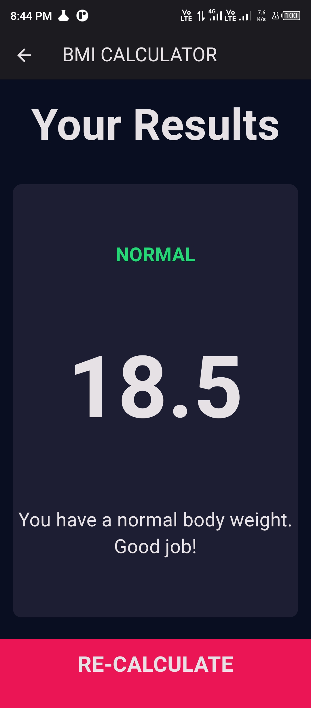
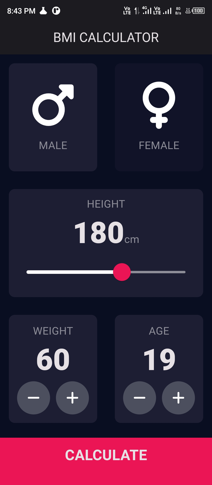

### BMI Calculator



BMI Calculator is a simple Flutter application that allows users to calculate their Body Mass Index (BMI) based on their height and weight. It provides insights into whether the user's weight falls within the underweight, normal, or overweight range, along with personalized tips for maintaining a healthy weight.

### Screenshots



### Features

- **Input Page**: Users can select their gender, input their height, weight, and age.
- **BMI Calculation**: Based on the input provided, the app calculates the BMI.
- **Result Page**: Displays the calculated BMI along with a category (Underweight, Normal, or Overweight) and personalized tips.
- **Recalculate Button**: Allows users to recalculate their BMI by navigating back to the input page.

### Tech Stack

- **Flutter**: The entire application is built using Flutter, a cross-platform UI toolkit.
- **Dart**: Flutter apps are written in the Dart programming language.

### Project Structure

```
bmi_calculator
│   main.dart
│   calculator_brain.dart
│   constants.dart
│
└───components
│   │   bottom_button.dart
│   │   icon_content.dart
│   │   reusable_card.dart
│   │   round_icon_button.dart
│   
└───screens
    │   input_page.dart
    │   result_page.dart
```

### How to Use

1. Clone the repository:

```
git clone https://github.com/zahidprvz/bmi_calculator.git
```

2. Navigate to the project directory:

```
cd bmi_calculator
```

3. Run the app:

```
flutter run
```

4. On the input page, select your gender, input your height, weight, and age.
5. Click on the "Calculate" button to see the results.
6. On the result page, view your calculated BMI, category, and personalized tips.
7. Click on the "Recalculate" button to go back to the input page and calculate again.

### Author

- Zahid Parvez ([GitHub](https://github.com/zahidprvz))

### Acknowledgments

This app is a simple demonstration of Flutter app development and is intended for educational purposes only. It is not intended to provide medical advice or diagnostics. Always consult with a healthcare professional for personalized health recommendations.
